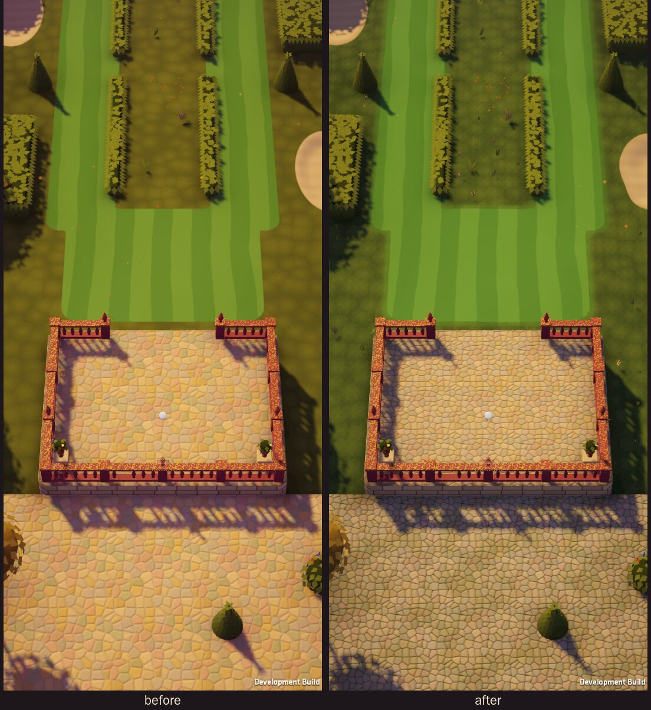
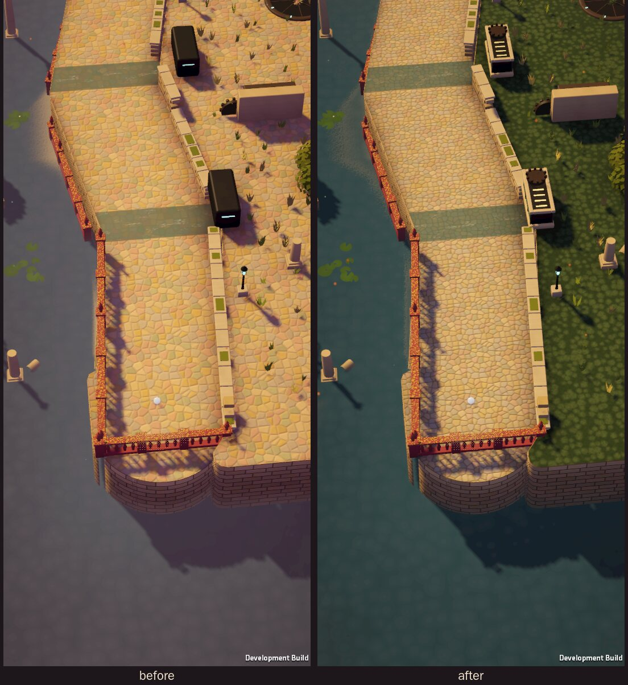
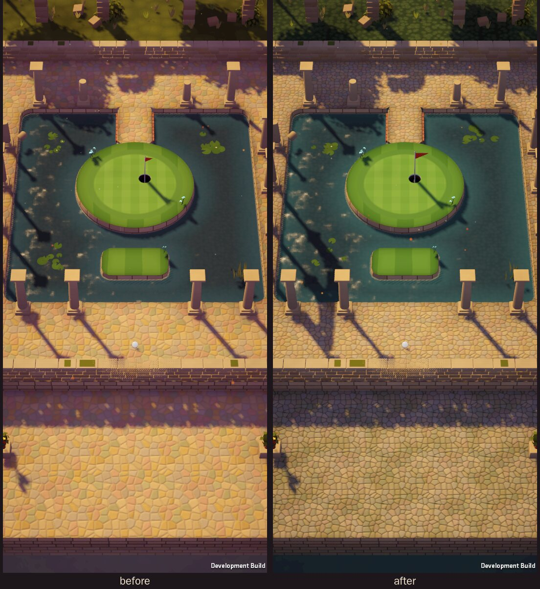
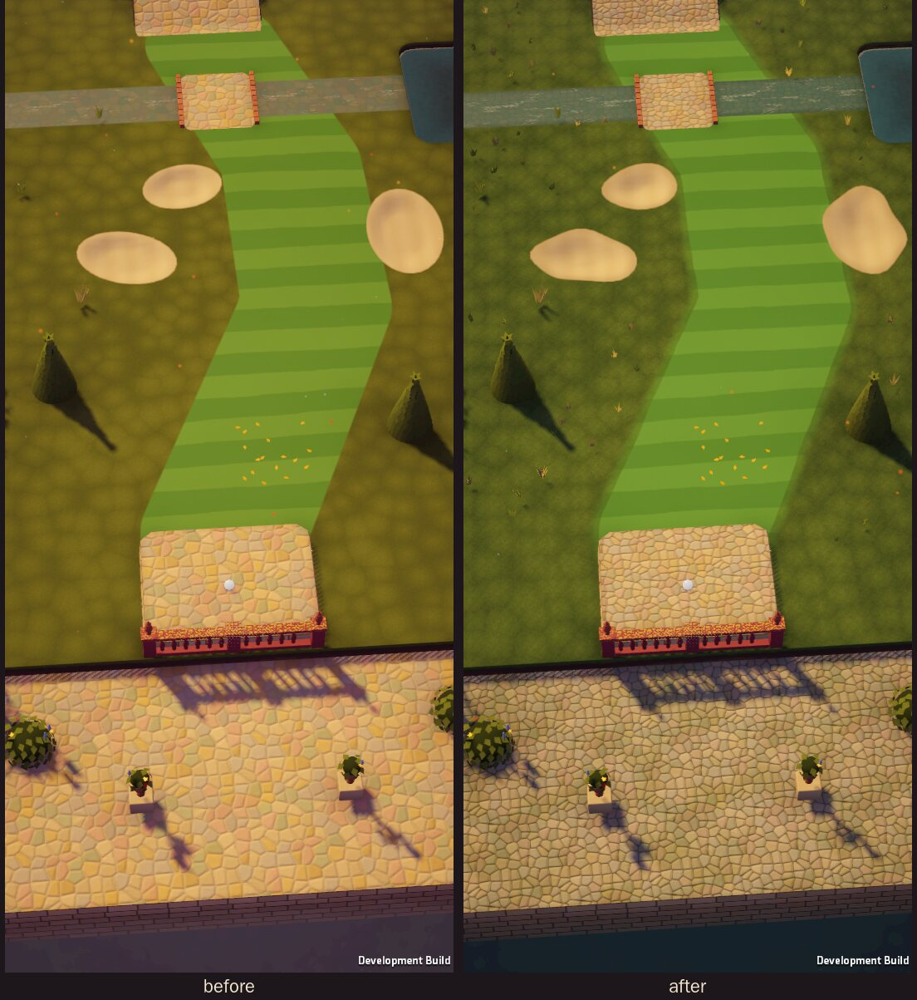

# BAD LIE — Art Direction

This document records what was actually observed in the three reference images and the
visual rules derived from them. It is the contract the environment kit, shaders and UI are
built against. Screenshots used for comparison live in `Docs/Screenshots/`.

## 1. Reference analysis (what is visible in each image)

### Death's Door — garden (PRIMARY)
Observed in the supplied 1920×1080 frame:

- **Ordered vs. wild.** A cobbled terrace is hemmed in by rectilinear clipped hedges and a
  crimson balustrade, while the top of the frame is a dense, untrimmed mass of autumn
  canopy (amber, saffron and red). Order sits in the middle of the frame and wilderness
  presses in from the edges.
- **Vegetation is sculpted, not scattered.** The conical topiary is built from overlapping,
  pointed leaf flakes. That gives a serrated silhouette and a pine-cone rhythm, warm olive
  on the lit side and brown-olive in shadow. The hedges are chunky blocks with flat tops,
  softened edges and notched leaf edging, and they are split into segments with small gaps.
  The round bushes in the flower bed are domes carrying small clusters of colour (blue
  hyacinth spikes, orange flowers that read as faintly self-lit, red blooms).
- **Stonework with authored pattern.** The path is pale sandy mortar with multicoloured
  setts (salmon, ochre, sage, grey) laid in overlapping fan arcs. Next to it is a crazy-paving
  zone of large polygonal flags with lighter grout. Each stone has a slight bevel and a darker
  outline. The flower beds have terracotta brick curbs with lighter caps.
- **The balustrade** is a deep crimson stone wall with turned balusters, square posts, urn
  finials and ochre lichen blotches on the top rail. Its outer face drops straight into the
  water.
- **Water** is still, muted pink-grey and reflective. It carries soft reflections of the
  balustrade shadow and the trees, with no visible chop. It is a flat, quiet plane that
  contrasts with the busy stonework.
- **Light** is soft and warm, and the shadows are warm violet-brown rather than black.
  Strong contact darkening where hedges meet the ground gives every mass weight.
- **HUD** is a compact top-left cluster with no text. A large diamond ability slot with a
  thin pale border and a white line-art bow sits over three smaller diamonds. Beside it are a
  segmented gold bar of four elongated hexagons and four small white hexagonal pips.

### COCOON — sculpted alien plateau (SECONDARY)
- **Solid, faceted forms.** A circular salmon plateau reads as a heavy slab. Its rim is a
  polygon of roughly 16–20 flat facets, with a concentric raised dais inside. The cliffs below
  are columnar, sharply creased faces in deep red-brown, with overhanging lips.
- **Machinery built into the ground.** The central device is a near-black rounded housing
  with a chunky bevelled rim, white slot lights, stacked blue light bars and glowing white
  petal segments inside. Thin radial seams run out from it across the dais, so the machine
  appears to be part of the landscape rather than placed on it.
- **Negative space.** Large flat, uncluttered floor areas. Detail (grass tufts, hexagonal
  pebbles, bleached branches, red stick-trees with feathery red leaf tufts) is clustered at
  edges and around landmarks.
- **Hard, long, tinted shadows** from monolith pillars with carved vertical grooves. The
  shadows are a darker salmon, not grey. Saturated red-pink ground patches break up the
  monochrome.
- **Interaction markers** are minimal white rings with a triangle: geometric, small and
  high-contrast.

### Hades II — Erebus forest (ACCENTS)
- **Selective luminance.** Pale cyan spectral flames sit on a shrine of drippy, waxy rock and
  tint nearby surfaces cyan. Small green-glowing hooded shades carry crescent marks. Glow is
  confined to a few objects.
- **Richly coloured shadow.** Shadows and unlit foliage are deep teal and indigo, with
  violet bell-flowers and mushrooms. They are never neutral black.
- **Lit focal clearing.** The character stands in a softly lit circular clearing with
  concentric labyrinth grooves cut into the ground. It is brighter than the dark vegetation
  around it, which guides the eye.
- **Foreground framing.** Near-black silhouetted branches and roots frame the lower left.
- **Typography and HUD.** The area title "E R E B U S" is set in widely tracked serif
  capitals under a crescent ornament. The bottom-left bars have angular arrow ends and white
  numerals ("50/50", "30/30").

## 2. Resolved rules for BAD LIE

One aesthetic: **a warm, late-afternoon ruined estate garden** (Death's Door language),
built from **heavy, deliberately faceted solids with machinery sunk into the ground**
(COCOON), with **sparing luminous plants, magical shot effects and coloured shadows**
(Hades II).

1. **Composition: order in the middle, wilderness at the frame.** Every hole is a manicured
   corridor (mown emerald fairway, raked sand, dressed stone) through overgrown ruin.
   Density rises with distance from the playing line: clean shot paths, then clipped hedges
   and walls, then rooted, overgrown masses, then atmosphere.
2. **Terrain has thickness.** Playable ground is a slab with a visible bevelled lip and a
   dark side face (soil and stone strata) that drops toward the flooded lower estate. No
   paper-thin planes. Elevation changes use ramps, retaining walls and steps.
3. **Vegetation in grouped masses with designed silhouettes.** Cones, domes and blocks made
   of leaf flakes or lumpy lobes, never single noisy spheres. Groups come in 3–7, with
   deliberate gaps. Autumn canopy (amber, saffron, red) marks tees and frames.
4. **Stonework carries pattern.** Fan-arc setts, crazy paving, coursed sandstone blocks,
   brick curbs. Stones have bevels, per-stone colour variation and dark grout outlines.
5. **Machinery is sunk into the landscape.** Turntables, sluices and gear housings are
   dark bronze-and-iron discs and housings set into stone. They show radial seams and a few
   pale lights, so moving forces are readable.
6. **Light: one warm low sun plus coloured ambient.** Warm key light (≈ 4300 K look), long
   soft shadows tinted violet-brown, and teal-tinted ambient in occluded areas. Contact
   darkening (baked vertex AO plus blob shadows) under every grounded object.
7. **Luminous accents are rare and meaningful.** Pale-cyan lantern lilies and amber
   glow-flowers appear only near hazards, cup approaches and upgrade-relevant spots. Shot
   magic (skip ripples, bank flashes, magnet rings) uses the same cyan/gold pair. Bloom stays
   restrained, and nothing is washed in purple: shadows are a cool blue-violet at 62%, not
   magenta, and the depths are teal.
8. **Gameplay readability beats decoration.** The ball is the brightest, highest-contrast
   object. The flag is a small vermilion pennant. Surfaces differ in hue, value and texture,
   not only colour (see §4). Foreground occluders fade when they overlap the ball or the
   aim line.
9. **Atmosphere for depth.** Two fogs, two jobs. Height fog sinks the flooded lower estate
   into a cool deep teal (`#173036`), so the course reads as lit slabs above shadowed depths.
   Distance haze fades far ruins and towers into a warm grey (`#8C8075`, which is also the
   camera background), giving COCOON-like negative space without a purple cast.
10. **Off-course ground steps back.** Out-of-bounds pads are flagged in the terrain mesh and
   drawn darker, cooler, less saturated and overgrown (meadow grass, moss in the paving
   joints), so playable ground is always the brightest, cleanest surface in the frame.

## 3. Garden biome palette

| Role | Hex | Notes |
|---|---|---|
| Fairway stripe A / B | `#5E9A47` / `#4F8A3D` | mown emerald, alternating bands |
| Green (putting) | `#79B656` / `#6CA94C` | finer, brighter stripes |
| Rough | `#5B7038` / `#465A2C` | deeper, cooler green; clumped, clustered tufts |
| Off-course meadow | rough × (0.70, 0.80, 0.90) | darker and cooler; desaturated 22% |
| Sand | `#E2C79B` | raked lines, pale and warm |
| Paving setts | `#CFB68F` with `#C9A28F` `#C8AA76` `#A9A98E` `#B5AB9F` | calm sandstone, muted salmon/ochre/sage/grey accents, dark joints `#8C7C66` |
| Terracotta curb | `#B4624A` | brick edging |
| Retaining / balustrade | `#9C3F48` | crimson stone, ochre lichen |
| Hedge lit / shadow | `#727C35` / `#46502A` | olive masses |
| Canopy amber / red | `#E3A33B` / `#C6512F` | tee trees, frame |
| Water deep / shallow | `#0D2A2D` / `#24504D` | dark teal, quiet, faint ripples |
| Shadow tint | `#7870A3` × 0.62 | cool blue-violet, multiplies into shade |
| Ambient (occluded) | `#2E4A52` | teal |
| Depth fog / distance haze | `#173036` / `#8C8075` | cool depths below, warm haze far away |
| Luminous accent | `#9BF3EA` / `#FFC56B` | cyan lilies / amber glow-flowers |
| Ball / flag | `#F8F6F1` / `#E0442F` | highest contrast on screen |

## 4. Material language (gameplay surfaces)

| Surface | Look | Feel |
|---|---|---|
| Fairway | emerald, wide mowing stripes, fine noise | medium roll |
| Green | brighter, tight stripes, collar ring | fastest roll, honest slopes |
| Rough | darker olive, clumped tufts at edges | heavy slowdown |
| Sand | pale, raked line pattern, soft rim lip | ball dies quickly |
| Stone | patterned sandstone setts, grout lines | fast, rebounds off curbs |
| Water | dark teal plane, slow ripples, leaf drift, foam at banks | hazard (Skip Stone exception) |
| Runnel (shallow flow) | clear water over stone, flow streaks | pushes the ball (machinery force) |

Each surface differs in **value** as well as hue, so they still read in greyscale. This is
checked against greyscale screenshots.

## 5. Camera, HUD and typography
- Perspective camera with a narrow field of view (~26° vertical), pitched ~55° and yawed so
  the course runs diagonally upward. The camera holds still while aiming and pans smoothly
  for course inspection.
- HUD: a compact top cluster inside the safe area. Strokes are shown as hexagonal pips plus
  a numeral, the hole title in tracked serif capitals, and owned upgrades in small diamond
  slots, all borrowed in spirit from the Death's Door cluster and the Hades title. Controls
  sit in the bottom thumb zone.
- Type: one tracked serif for titles and one clean sans for numbers and effects (both
  SIL OFL, see `Docs/AssetRecord.md`).

## 6. Mobile rendering budget (target)
- URP Forward, MSAA 2×, HDR off on low tier, render scale 1.0 (0.8 on low tier).
- One directional light with real-time shadows: 1 cascade, 1024–2048 px, shadow distance
  tuned per hole to about 45 m. Soft shadows on high tier only.
- Ambient occlusion and contact darkening are baked into vertex colours at kit-build time.
  No SSAO.
- Post: tonemapping, colour adjustments and restrained bloom (threshold ≥ 1.1) in one pass.
  No depth of field. Vignette is subtle.
- Targets: ≤ 150 batches with the SRP Batcher, ≤ 250k triangles on screen, ≤ 2 transparent
  full-screen layers. Water uses vertex data instead of a depth texture.

## 7. Comparison against the references, and the three largest fixes

After all five holes were playable, every hole was captured at phone resolution in a player
build, with the real game camera and the bot playing, and compared side by side with the three
references. These were the three largest weaknesses and what was changed.

### 1. Flat, vector-like ground, with off-course ground that read as playable
*Against Death's Door:* its ground is layered and textured, and the play space is obvious
at a glance. Ours had these problems:
- The rough was a uniform olive plane.
- Fairway edges were ruled curves, and bunkers were perfect ellipses.
- The crazy paving was loud and multicoloured.
- The out-of-bounds courts and the Sluice Walk machine yard used the same paving as the
  playable ground, so they looked playable.

**Fix:**
- Out-of-bounds pads are flagged in the terrain mesh (`TEXCOORD2.w`) and drawn darker,
  cooler, desaturated and overgrown. The machine yard became meadow.
- Calmer paving palette with dark joints and smaller setts.
- Fairway edges wobble slightly and sit inside a lighter first cut.
- Bunkers have organic outlines, shared with the physics, plus a damp rim and a sunlit turf
  lip.
- The rough has a blade texture and clustered grass tufts.

### 2. A purple wash over everything below the course
*Against Death's Door and Hades II:* Death's Door's water is dark and quiet, and Hades
colours its shadows without washing the frame. Ours:
- The single height fog was mauve, so the water, ruins and lower estate all turned
  purple-grey, the flat "purple wash" the brief warns against.
- Shadows leaned magenta.

**Fix:**
- The fog is split in two: a cool teal depth fog for the lower estate and a warm grey haze
  for distance.
- The water is darker teal.
- Shadow, AO and ambient tints are bluer.

### 3. Primitive props
*Against COCOON:* its machinery is sunk into the ground with rims, seams and pale lights.
Ours:
- The machine blocks were black boxes that read as bins.
- The cup was a flat black disc.
- A far tower filled the top of the Orrery frame as a pink cylinder.
- The runnels read as grey roads.

**Fix:**
- Sluice housings: stone plinth, coping frame, verdigris panels, amber slots and a gear.
- A cup with a white liner and a depth gradient.
- Towers moved out of the play view and cooled, with amber lantern windows; drowned ruins
  fill the water instead.
- Runnels are teal water with flow streaks, a wet inner edge and a dry kerb.
- A ruined arcade gives the Flooded Cloister its cloister.

Before and after, captured from the same tee with the same camera:

| | |
|---|---|
|  |  |
|  |  |

### Remaining gaps
- **Trees** are single rounded leaf masses. They are not yet the layered, lobed canopies of
  the Death's Door frame.
- **No horizon in play.** The play camera looks down at 52°, so it never sees the horizon.
  Distant towers and aqueducts appear in the survey and overview views, while the play
  view relies on drowned ruins and the depth fog.
- **Opaque water.** It is stylised with no true reflections, a deliberate choice for the
  mobile budget.
- **Luminous plants** (lantern lilies, amber flowers) are small at play zoom. The glow
  accents read mainly on machinery and in shot effects.
