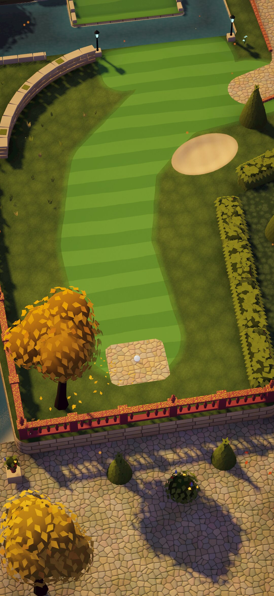
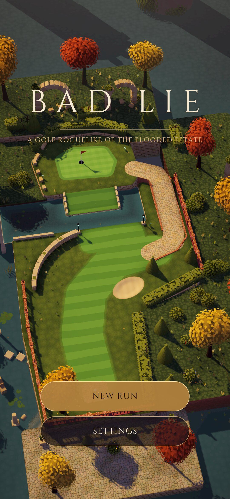
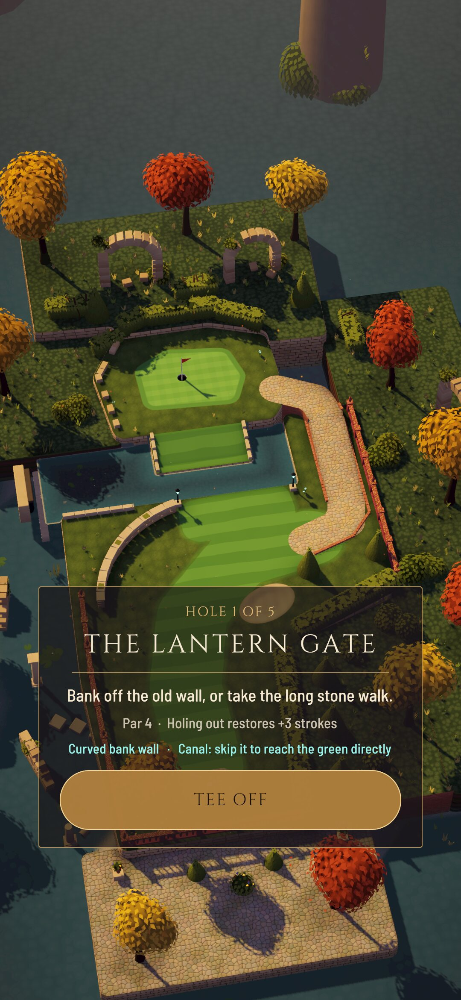
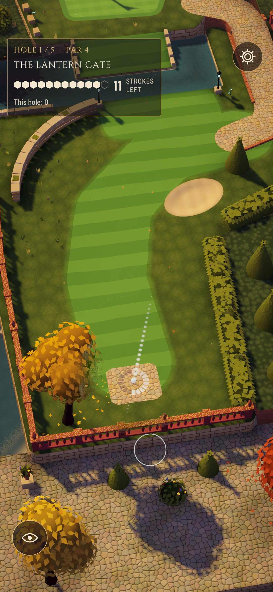
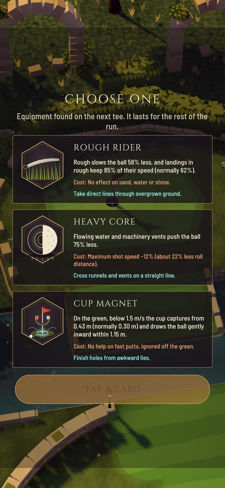
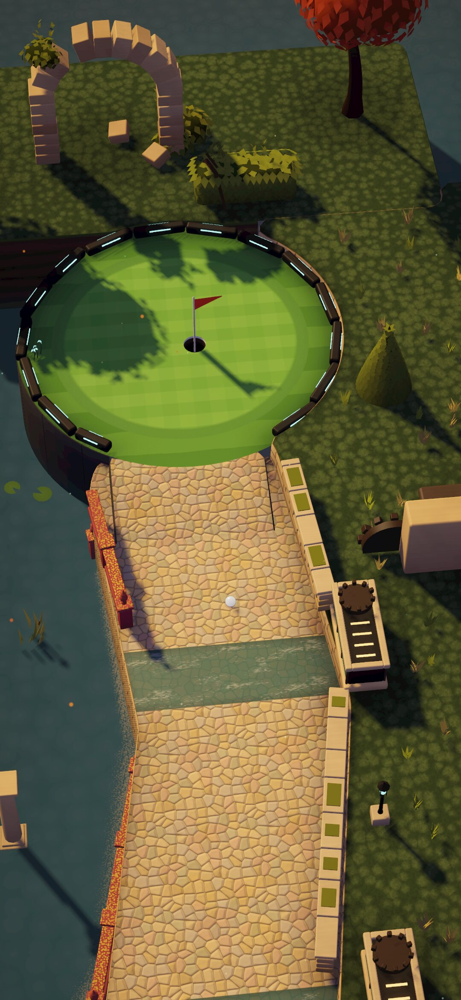
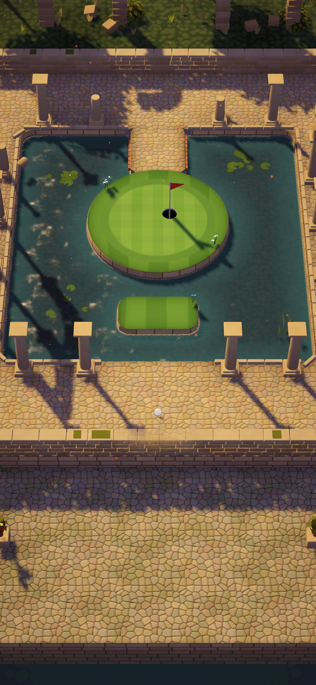
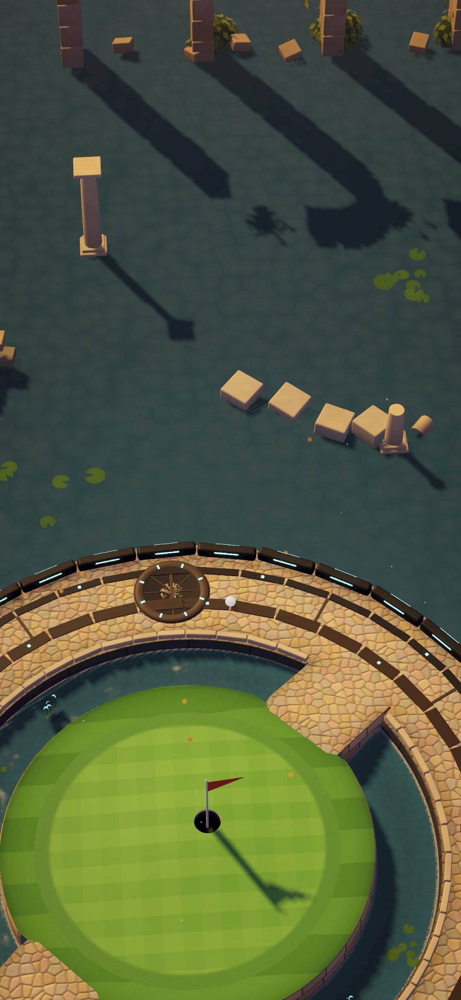
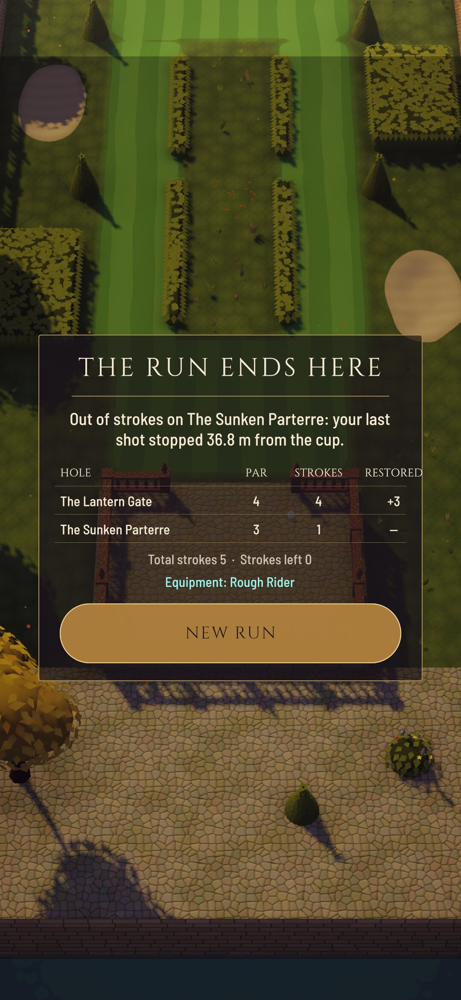

# BAD LIE

A mobile golf roguelike for portrait phones, built in **Unity 6 LTS (6000.3.25f1, URP)**.
You play five holes through a ruined estate garden on one shared stroke budget. Holing out
restores strokes, and between holes you pick one of three upgrades that change how the ball
behaves. A run takes about 5–10 minutes.



## Contents

- [Launch instructions](#launch-instructions)
- [How to play](#how-to-play)
- [Run rules](#run-rules)
- [Upgrades and combos](#upgrades-and-combos)
- [The five holes](#the-five-holes)
- [What was tested, and where](#what-was-tested-and-where)
- [Command-line tools](#command-line-tools)
- [Project layout](#project-layout)
- [Documents](#documents)

## Launch instructions

### Play in the Unity editor (desktop)
1. Install **Unity 6000.3.25f1** (Unity Hub ▸ Installs ▸ Install Editor ▸ Archive). Add the
   **Android Build Support** and/or **iOS Build Support** modules if you want device builds.
2. Open this folder as a project in Unity Hub. The first import takes a few minutes.
3. Run **BAD LIE ▸ Setup Project** once. It generates the materials, textures, UI, audio
   import settings, the scene and the kit prefabs. It is idempotent, so you can run it again
   at any time.
4. Open `Assets/BadLie/Scenes/Main.unity` and press **Play**. In the Game view, choose a
   portrait resolution such as 1080×2340 so the layout matches a phone.

The mouse works like a finger. Drag back from anywhere to aim and release to shoot.
Right-click or Esc cancels a shot, and the scroll wheel zooms in survey mode.

### Install on an Android phone
A test APK was built headless in this environment: `Builds/Android/BADLIE.apk`, 32.8 MB.
- It is IL2CPP, ARM64, targets Android 16 (API 36) with a minimum of Android 8, and is
  signed with the Unity debug key. `apksigner verify` passes.
- It is not committed to git (`Builds/` is ignored); it was delivered alongside this branch.
- Install it with `adb install -r BADLIE.apk`, or copy it to the phone and allow installs
  from unknown sources.
- It has **not** been run on a device yet.

To build it yourself:
1. In Unity, **File ▸ Build Profiles ▸ Android ▸ Switch Platform**. This needs the Android
   Build Support module with its SDK, NDK and OpenJDK. On a headless Linux editor,
   `Tools/unity/install_android.sh` installs all of it.
2. Run **BAD LIE ▸ Build ▸ Android APK**, or **Build And Run** with the phone connected over
   USB with USB debugging on. The output is `Builds/Android/BADLIE.apk`, which you can install
   with `adb install -r Builds/Android/BADLIE.apk`.
   - The project targets Android 8.0+ (API 26), ARM64 and IL2CPP, with Vulkan and a
     GLES3 fallback.

### Install on an iPhone
**File ▸ Build Profiles ▸ iOS ▸ Build** produces an Xcode project. Open it on a Mac with Xcode,
set your signing team and run it on the device. The target is iOS 15+.

### Accounts
BAD LIE is a fully offline single-player game. It has no login, server or store integration,
so **no test account is needed**. Progress, meaning the current run and settings, is saved
locally on the device.

## How to play

- **Aim:** touch anywhere that isn't a button and drag *back*, away from where you want the
  ball to go. The direction is measured on the course itself, and the pull length sets the
  power. The ring around the ball shows power, and the dotted line shows the first part of
  the real shot, which is the same simulation that will play out.
- **Shoot:** release.
- **Cancel:** slide back into the small circle where you started and release, or touch with a
  second finger. With a mouse, right-click or press Esc.
- **Survey:** the eye button switches the camera to free panning. Drag to look around the
  hole, pinch or scroll to zoom, and press the eye again to return to the ball.
- **Settings:** the gear button opens separate sound and music volume, a left-handed layout
  (which mirrors the bottom buttons) and abandoning the run.
- **Resume:** closing the app mid-run is safe. **Continue** on the title screen restores the
  run exactly. A shot that was still rolling when the app closed is re-simulated
  deterministically, so it ends where it would have.

## Screenshots

These are real frames from the game running in a Linux player build at 1080×2340 (a common
phone resolution), driven by scripted touch input. Holes are played by the shot-planner bot
through the same aim and shot path as a finger. None of them are renders.

| | | | |
|---|---|---|---|
|  |  |  |  |
| Title | Hole card | Aiming: power ring and true preview | Choose 1 of 3 |
|  |  |  |  |
| The Sluice Walk | The Flooded Cloister | The Orrery | The exact failure verdict* |

All frames are in [`Docs/Screenshots/final`](Docs/Screenshots/final):
- The full loop, F01–F11, including cancel, survey, settings, the ball rolling, hole complete
  and resume.
- The tee and approach of every hole, A1–A5.
- Skip Stone, Bank Shot and Cup Magnet caught mid-shot, X1–X3.
- A safe-area check with a simulated notch and gesture bar.

\*The failure frame was produced by the capture script setting the budget to one stroke and
playing a deliberate miss, to show the verdict screen without playing a whole losing run.

## Run rules

| Rule | Value |
|---|---|
| Holes per run | 5 (par 4, 3, 4, 4, 5: 20 in total) |
| Starting strokes | **11** |
| Restored on holing out | **+3**, plus **+1** for finishing under par |
| Water or out of bounds | +1 penalty stroke; the ball returns to its last lie |
| Upgrades | after holes 1–4, choose 1 of 3 (no duplicates) |
| Run lost | when you have no strokes left and the ball is not in the cup |

The last shot always resolves first: a ball still rolling on your final stroke can drop. The
run is only judged after it stops. The result screen states the exact reason, for example
*"Out of strokes on The Sluice Walk: your last shot stopped 2.4 m from the cup."*, and shows
the hole-by-hole scorecard.

Variation without randomness in the shots: each run picks a pin position for every hole from
the authored, playtested set (three per hole) and deals upgrade offers from a seeded shuffle.
Ball physics has no random element at all.

## Upgrades and combos

| Upgrade | Effect | Trade-off |
|---|---|---|
| **Skip Stone** | Once per shot, a ball hitting water at ≥ 3 m/s skips instead of sinking (keeps 86% speed, hops 2–4 m). | One skip per shot. |
| **Bank Shot** | The first wall rebound of every shot keeps 92% of its speed into the wall (normally 56%). | First rebound only. |
| **Rough Rider** | Rough slows the ball 58% less, and landings in rough keep 85% of their speed (normally 62%). | No effect on sand, water or stone. |
| **Heavy Core** | Runnels and vents push the ball 75% less. | Max shot speed −12%. |
| **Cup Magnet** | On the green below 1.5 m/s, the cup captures from 0.43 m (normally 0.30 m) and pulls the ball in within 1.15 m. | No help on fast putts. |
| **Second Chance** | Once per run, undo your last shot: the ball returns to its lie and the stroke and any penalty are refunded. | One use per run. |

| Combo | Needs | Effect |
|---|---|---|
| **Ricochet** | Skip Stone + Bank Shot | A water skip re-arms Bank Shot, so you can skip a channel and bank off the far wall. |
| **Groundbreaker** | Heavy Core + Rough Rider | Sand slows the ball 40% less, and Heavy Core's speed loss is halved to −6%. |

## The five holes

| # | Hole | Par | Idea |
|---|---|---|---|
| 1 | The Lantern Gate | 4 | Tee under an amber tree. A narrow emerald fairway curls past a curved sandstone bank wall to a dark canal in front of a raised green. You can go the long way round on a stone-edged path, or skip the canal. |
| 2 | The Sunken Parterre | 3 | Drop off a balustraded terrace into a formal sunken garden. Zig-zag fairway lanes run round hedge boxes; the straight line cuts through overgrown beds (Rough Rider's line) to an undulating raised green. |
| 3 | The Sluice Walk | 4 | A stone causeway along the flooded edge of the estate. Three runnels push the ball toward the drop. A long sandstone wall rewards bank shots, and the green sits on a machine dais with a vent. |
| 4 | The Flooded Cloister | 4 | A ruined arcade round a flooded court with an island green. A low coping guards the walkway: bank round the corners and cross the bridge, or skip two short gaps by way of a stepping stone. |
| 5 | The Orrery | 5 | The estate's great machine: a dais ringed by vents that bend the ball clockwise, and a moat round a domed island green, reached by two bridges or a skip through the gap in its coping. A meadow shortcut runs past bunkers and a runnel. |

## What was tested, and where

**Verified on desktop (Linux, Unity 6000.3.25f1, software rendering under Xvfb):**
- **EditMode tests (34), all passing.** They cover the ball simulation, the course
  geometry and the run rules:
  - The simulation is deterministic, and the aim preview is a prefix of the real shot.
  - No tunnelling at full speed; walls, ledges and ramps; cup capture and lip-outs.
  - Every upgrade and both combos.
  - Mesh winding on every hole; terrain heights match the physics; every pin sits on a
    green; tees are clear.
  - Every pin has a rolling route from the tee; the bot holes every hole within par+1.
  - The run rules: final-shot resolution, penalties, Second Chance, offers, and save/resume.
- **Bot playtests:** thousands of simulated shots over every hole, pin and loadout at three
  skill levels, and whole runs through the real rules. The stroke budget was tuned from
  these, see [`Docs/Tuning.md`](Docs/Tuning.md).
- **The Android APK builds:** IL2CPP, ARM64, signature verified. It has not been run on a
  device.
- **Scripted play in a Linux player build at 1080×2340** with injected touch input. This
  produced the screenshots in [`Docs/Screenshots/final`](Docs/Screenshots/final):
  - The full loop: title, hole card, HUD, aiming, cancel, the ball rolling, hole out,
    upgrade choice and the next hole.
  - Resuming an interrupted run, and the failure verdict.
  - Every hole, plus the Skip Stone, Bank Shot and Cup Magnet effects in real shots.
  - A simulated notch and gesture bar (`-safearea`) to check the safe-area layout.

**Not verified on a real phone:** this environment has no GPU and no device. The following
still need a device test:
- Frame rate and thermals.
- Touch feel at native DPI.
- Real notch and cut-out safe areas.
- Audio latency.
- The Android and iOS builds themselves.

Performance is designed for mobile (one shadowed light, static batching, vertex-colour
materials, no depth texture; see `Docs/ArtDirection.md` §6). The measured scene cost per hole
is listed in `Docs/Tuning.md`, but nothing here measures phone performance.

## Command-line tools

All tools run headless; `Tools/unity/unity.sh` wraps the editor and starts a virtual display.

```bash
# One-time project generation (materials, textures, scene, prefabs)
Tools/unity/unity.sh setup -nographics -quit -executeMethod BadLie.EditorTools.ProjectSetup.Run
# Tests
Tools/unity/unity.sh tests -nographics -runTests -testPlatform EditMode -testResults "$PWD/Logs/tests.xml"
# Bot playtest report -> Logs/playtest.md, Logs/playtest_runs.csv
Tools/unity/unity.sh playtest -nographics -quit -executeMethod BadLie.EditorTools.Playtest.Run
# Builds
Tools/unity/unity.sh build -quit -executeMethod BadLie.EditorTools.BuildTools.BuildLinuxRelease
Tools/unity/unity.sh apk   -quit -executeMethod BadLie.EditorTools.BuildTools.BuildAndroid
# Scripted screenshots from the Linux player (scenarios: flow, lookall, holes, fx)
BADLIE_PLAYER=Builds/LinuxRelease/BADLIE.x86_64 Tools/unity/capture.sh flow 1080 2340
```

Editor menus: **BAD LIE ▸ Setup Project**, **Create Kit Prefabs**, **Preview Hole ▸ 1–5**
(builds a hole into the open scene), **Playtest (bots)** and **Build ▸ …**

## Project layout

```
Assets/BadLie/
  Scripts/Core/     engine-agnostic game logic (asmdef BadLie.Core)
    Math/           SDF shapes, deterministic RNG and noise
    Course/         hole definitions, compiled course model (heights, surfaces, walls, zones)
    Sim/            the deterministic ball simulation (240 Hz) and its tuning
    Run/            run rules, upgrades, run state (save format)
    Bot/            distance field and shot planner used by tests and playtests
    Geometry/       terrain mesher, procedural environment kit (stone, foliage, machines)
    Holes/          the five authored holes
  Scripts/Game/     Unity presentation (asmdef BadLie.Game): views, camera, input, UI, audio, flow
  Editor/           setup, build, playtest and kit tools
  Shaders/          custom URP shaders (terrain, water, foliage, lit, ball, glow, FX)
  Tests/Editor/     EditMode tests
  Kit/              one prefab per kit piece and variant
Tools/              batch runner, capture script, audio and illustration generators
Docs/               art direction, tuning, asset record, handoff, screenshots
```

## Documents

- [`Docs/ArtDirection.md`](Docs/ArtDirection.md): analysis of the three references, the
  visual rules, the comparison against the references and the fixes made.
- [`Docs/Tuning.md`](Docs/Tuning.md): physics and economy values and the bot playtest data
  behind them.
- [`Docs/AssetRecord.md`](Docs/AssetRecord.md): the origin and licence of every asset.
- [`Docs/Handoff.md`](Docs/Handoff.md): environment notes for working on this project headless.
